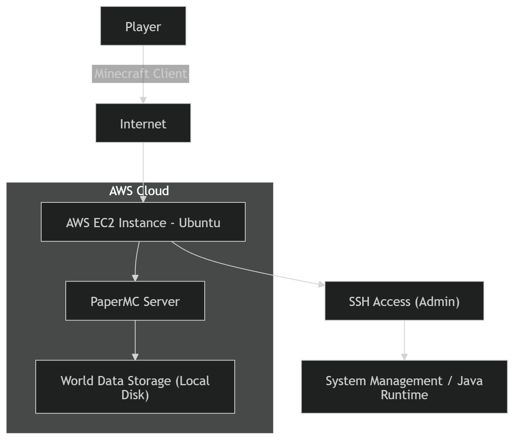

# AWS EC2 Minecraft Server

Self-hosted Minecraft server environment deployed on AWS EC2 using Ubuntu, configured manually via SSH using Java and PaperMC. This project demonstrates hands-on experience with cloud infrastructure, Linux system administration, networking through AWS Security Groups, and server troubleshooting in a real AWS environment.

## Overview

This project documents the process of deploying and configuring a Minecraft server environment on an AWS EC2 instance running Ubuntu Linux.

The goal was to gain practical experience with cloud infrastructure, Linux server administration, Java runtime management, and debugging production-like server issues.

## Architecture

## System Flow

1. A player connects to the server using the EC2 public IPv4 address.
2. AWS Security Groups control inbound traffic to the instance.
3. Minecraft traffic is allowed through TCP port `25565`.
4. SSH administration is handled through TCP port `22`.
5. The EC2 instance runs Ubuntu Server and hosts the Minecraft/PaperMC server environment.
6. Server files, logs, and world data are stored locally on the instance.

## Tech Stack

- AWS EC2
- Ubuntu Server
- Java / OpenJDK
- PaperMC
- Minecraft Java Edition
- SSH / Linux CLI
- AWS Security Groups

## Setup Process

- Provisioned an EC2 instance on AWS
- Connected to the instance remotely using SSH
- Configured AWS Security Groups for SSH and Minecraft traffic
- Installed and managed Java runtime versions
- Downloaded and tested Minecraft/PaperMC server builds
- Configured server settings and accepted the Minecraft EULA
- Started and managed the server through the Linux terminal
- Debugged runtime issues using server logs and CLI output

## Challenges Solved

- Java version mismatch between OpenJDK 17, 21, and 25
- PaperMC startup failures caused by unsupported Java runtime versions
- Incorrect Java version being selected by the system
- Minecraft/PaperMC server startup issues
- AWS networking configuration for public access
- Debugging server logs directly from the Linux CLI

## Key Learnings

- AWS EC2 provisioning and basic cloud networking
- Linux server administration through SSH
- Security Group configuration for public services
- Java runtime management on Linux
- Troubleshooting server applications in a production-like environment
- Importance of clear documentation and architecture diagrams

## Current Status

The EC2 infrastructure and server environment were successfully configured and tested. PaperMC was installed and tested, with additional debugging performed around Java compatibility and world initialization issues.

## Security Note

During initial testing, inbound access was opened broadly using `0.0.0.0/0` to make setup and connection testing easier.

In a production environment, SSH access on port `22` should be restricted to a trusted IP address, while the Minecraft port `25565` can be opened publicly if the server is intended to be accessible by players.

## Future Improvements

- Add automated startup using `systemd`
- Add automated backups
- Add monitoring for CPU, memory, and server status
- Containerize the server using Docker
- Rebuild the infrastructure using Terraform
